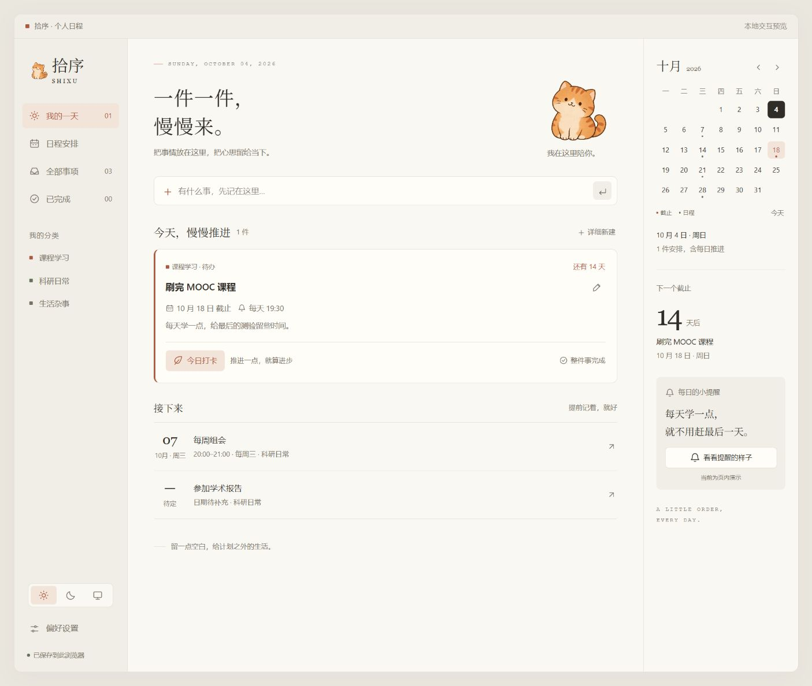
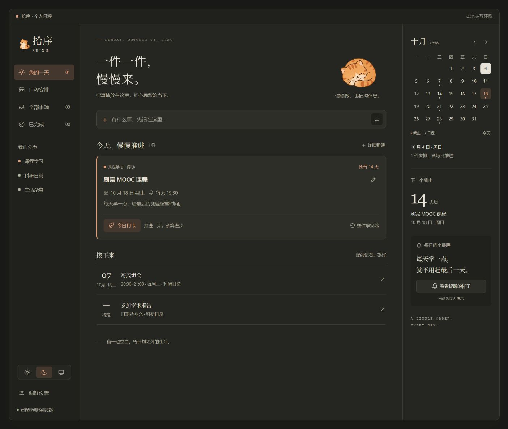

<div align="center">


# 拾序 · Shixu

**A little order, every day.**

A Windows desktop planner with a hand-drawn cat for company.<br>
Make room for coursework, research, and the rest of your day.

[](https://github.com/womeimingzi/shixu/releases/latest)
[](https://github.com/womeimingzi/shixu/releases/latest)
[](https://github.com/womeimingzi/shixu/actions/workflows/checks.yml)
[](LICENSE)

[简体中文](README.md) · **English**

[Download](https://github.com/womeimingzi/shixu/releases/latest) · [Get started](#-get-started) · [Develop](#-run-from-source) · [Share feedback](https://github.com/womeimingzi/shixu/issues)

</div>

<picture>
  <source media="(prefers-color-scheme: dark)" srcset="assets/previews/shixu-night.jpg">
  
</picture>

<p align="center"><sub>Cream Desk / Midnight Notes · Browser interface preview with sample records; the desktop build also has native window controls.</sub></p>

## 🌿 A place for the things on your mind

A course to finish. A seminar date buried in a chat. A lab meeting every Wednesday. Shixu brings those everyday commitments together: capture the deadline, make time for steady progress, and let a quiet little cat keep you company.

**Checking in today does not finish the whole task.** You can make daily progress on a course until you mark it complete. Finish this week's meeting, and next week's occurrence stays on the calendar.

| What you need | How Shixu helps |
| --- | --- |
| 📚 Finish coursework on time | Deadlines and daily reminders, with separate progress check-ins and task completion |
| 🗓️ Remember seminars and lab meetings | Dates, start/end times, locations, notes, and weekly recurrence |
| 🔔 Get a nudge at the right time | Windows notifications, ten-minute snooze, and background tray support |
| ☀️ A calmer workspace | Cream and warm dark themes, system theme support, and a hand-drawn orange cat |
| ✍️ Capture now, organize later | Enter to add, detailed editing, categories, calendar filtering, and deadline countdowns |
| 🗂️ Keep your records close | Local files, previous-save backup, JSON export/import, and trash recovery |

<details>
<summary><strong>See both themes</strong></summary>

| Cream Desk · Day | Midnight Notes · Night |
| :---: | :---: |
|  |  |

</details>

## 🐾 Get started

1. Download **`Shixu-VERSION-windows-x64.zip`** from the **[latest release](https://github.com/womeimingzi/shixu/releases/latest)**.
2. **Extract the entire archive** to a folder of your choice.
3. Double-click the paw-icon executable, **`拾序.exe`**.

No Node.js, Python, account, or browser server is needed to use a release. Keep the accompanying files next to the executable. The first launch includes three editable sample records to help you get familiar with the app.

The current release is a Windows x64 portable build. **The application interface is currently Simplified Chinese only.** Documentation is available in Chinese and English; an English UI has not been implemented. Releases are currently unsigned, so Windows may show a publisher warning. Use the release's `SHA256SUMS.txt` to verify your download.

### Your first few items

- **Coursework:** create a task, set a deadline, enable daily progress, and choose a reminder time.
- **Lab meetings:** create an event, set its first date and time, and select weekly recurrence.
- **Start with Windows:** enable automatic startup in Preferences. It is off by default; enabling it starts the app silently in the tray.
- **Check notifications:** send a test notification from Preferences to confirm that Windows displays it.

| Action | Shortcut |
| --- | --- |
| Save an item in the capture field | `Enter` |
| Open the detailed creation dialog | `Alt` + `N` |
| Close a dialog | `Esc` |

Closing the window keeps Shixu in the tray by default, so reminders continue. Right-click the tray icon and select Exit to stop it completely. Launching the executable again opens the existing window.

## 🔔 When will it remind me?

| Reminder | Current rule |
| --- | --- |
| Daily progress | At the task's chosen time; today's check-in suppresses today's daily reminder |
| Timed event | Ten minutes before it starts |
| Date-only event | 09:00 on that date |
| Task deadline | 09:00 the day before and on the due date |
| Snooze | Click a notification to open the item, then choose another reminder in ten minutes |

Delivery records and snoozes are stored locally to avoid repeating notifications on every restart. When the computer resumes, Shixu checks for reminders that are still relevant.

**Current limits:** schedule times use a fixed UTC+8 timezone. Notifications cannot fire while the app has fully exited or the computer is asleep or powered off. Windows Do Not Disturb and notification settings may suppress them. Mobile push, cloud sync, automatic updates, and custom recurrence rules are not implemented.

## 💾 Your records stay with you

Data lives in **`%APPDATA%\Shixu`**, separately from the application folder. Shixu has no account system, telemetry, or cloud service; everyday scheduling and reminders run locally.

- `state.json` contains records, preferences, the delivery ledger, and snoozes.
- `state.backup.json` retains the preceding successful save, not a complete version history.
- Preferences includes Open data folder, JSON export, and additive import. Import preserves existing items; different content sharing an ID is added as a new item.
- Export independent backups periodically. The browser preview uses browser storage and does not automatically sync with the desktop application.

To update, exit the tray application and replace the entire application folder with a freshly extracted release. The data directory remains separate. Updates are currently manual.

## 🛠️ Run from source

Recommended environment: **Windows x64, Node.js 24, npm, and Git**.

```powershell
git clone https://github.com/womeimingzi/shixu.git
cd shixu
npm ci
npm run setup:runtime
npm start
```

`setup:runtime` ensures the Electron runtime is installed; the first installation needs network access. Automatic startup is available in packaged builds only.

```powershell
npm test             # Date, recurrence, reminder, import, and storage tests
npm run dist         # Windows x64 application → dist/win-unpacked/
npm run package:zip  # Distributable ZIP and SHA256SUMS.txt → dist/
```

For interface work, run `npm run preview` and open `http://127.0.0.1:8767/handdrawn-preview.html`. Native notifications, tray support, and automatic startup require the desktop build. If the port is busy, set `$env:PORT=8768` in PowerShell before starting the preview.

<details>
<summary><strong>Repository map</strong></summary>

```text
desktop/                 Electron main process, reminders, local storage
src/                     Interface, themes, date and data rules
assets/mascots/           Hand-drawn orange cat artwork
assets/previews/          Day and night interface examples
build/                   Paw application icons
tests/                   Native Node.js tests
tools/                   Preview, icon generation, and packaging
docs/                    Architecture, assets, and English user guide
.github/workflows/       Windows checks, build, and artifact validation
handdrawn-preview.html   Shared page entry for desktop and browser preview
```

The interface uses plain HTML, CSS, and JavaScript. Electron supplies the desktop runtime; electron-builder packages it. No frontend framework or remote backend is required. Run `npm run icon` to regenerate the paw icon.

Read the [architecture notes](docs/ARCHITECTURE.md), [asset notes](docs/ASSETS.md), and [contribution guide](CONTRIBUTING.md) for more detail.

</details>

## 🤝 Help shape the next version

This is Shixu's first public release. [Issues](https://github.com/womeimingzi/shixu/issues) and contributions are welcome, including accessibility improvements, an English interface, configurable timezones, and reminder rules. These are possible next steps, not existing features.

Remove personal schedule details from screenshots and logs before sharing. See [CONTRIBUTING.md](CONTRIBUTING.md) and [CHANGELOG.md](CHANGELOG.md).

## 📄 License

[MIT License](LICENSE) · Copyright © 2026 womeimingzi. Use, modify, and distribute the code while retaining the license and copyright notice. See [asset notes](docs/ASSETS.md) for the cat and icon. Bundled dependencies retain their own license files.

<div align="center">

<sub>A little order, every day.<br>一件一件，慢慢来。</sub>

</div>
