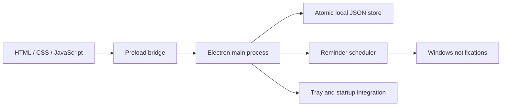

# 架构 / Architecture

## Overview



界面与日期规则在网页预览和桌面版间复用。桌面能力经最小化 preload 接口访问；网页模式使用 `localStorage`，仅用于界面开发。两种模式不会持续同步。

The renderer and date rules are shared by desktop and browser preview. Native capabilities are exposed through a narrow preload bridge. Browser mode uses `localStorage` for interface development; it does not continuously synchronize with desktop data.

## Responsibilities

| File | Responsibility |
| --- | --- |
| `handdrawn-preview.html` | Shared page and dialogs |
| `src/styles.css` | Layout, theme variables, native window adaptation |
| `src/app.js` | Views, editing, check-ins, completion, import/export UI |
| `src/schedule.mjs` | Calendar arithmetic, weekly occurrences, initial demo records |
| `src/data.mjs` | Data validation and additive import |
| `desktop/main.mjs` | App lifecycle, window, tray, native notifications, IPC |
| `desktop/preload.cjs` | Explicit renderer-to-main API |
| `desktop/store.mjs` | Atomic writes, previous-save backup, recovery |
| `desktop/reminders.mjs` | Pure reminder selection from tasks, time, ledger, and snoozes |

## Data and time

The desktop state envelope contains `data`, `preferences`, `ledger`, and `snoozes`. The exported planner data has schema version `2`, a theme, and task records. Task records distinguish `task` from `event`, store date-only values as `YYYY-MM-DD`, and keep daily check-ins separate from completed weekly occurrences.

Date arithmetic uses UTC to avoid daylight-saving shifts in plain dates. The meaning of “today” and scheduled reminder times currently uses **UTC+8 / Asia/Taipei**, independent of the computer's timezone. Changing this requires coordinated updates to date selection, reminder due times, persistence, and tests.

The main process checks reminders every 30 seconds and on resume. A persisted ledger avoids duplicate dispatch after restart. Catch-up is bounded: daily/deadline reminders remain eligible through their calendar day; timed events through their end time, or one hour after the start when no end is supplied. A snooze is eligible for 24 hours after its scheduled time. This is an application timer, not a Windows wake timer.

数据目录为 `%APPDATA%\Shixu`。保存先写临时文件，再替换主文件，并保留上一次备份。主文件损坏时优先恢复有效备份，同时保留损坏副本供排查。导入只追加：内容相同的同 ID 事项跳过；内容不同则生成新 ID。

The data directory is `%APPDATA%\Shixu`. Saves write a temporary file before replacing the main file and retain the previous save. Recovery preserves damaged files for diagnosis. Import adds records, skips identical ID/content pairs, and gives conflicting content a new ID. Backups contain personal information and must not enter the repository.

## Renderer boundary

The BrowserWindow enables sandboxing and context isolation, disables Node integration, and uses a CSP. The custom `shixu://app` protocol serves an explicit local resource allowlist. New windows, navigation, and permission requests are denied. IPC checks the sending window and main frame; data and preference payloads are validated. No general filesystem or shell interface is exposed to the renderer.

These are implementation safeguards, not a claim of a completed security audit. Keep dependency updates and renderer escaping in scope when reviewing changes.

## Validation and releases

```powershell
npm ci
npm run setup:runtime
npm test
npm run dist
npm run package:zip
```

The Windows Actions workflow repeats installation, tests, packaging, and an isolated packaged-app smoke test. The smoke test checks that the page and renderer load, a tray is created, and closing hides the window. It does not prove Windows toast delivery; test that through Preferences on a real desktop.

For a manual isolated smoke test, set `SHIXU_TEST_DIR` to a new temporary directory and run the packaged executable with `--self-test`. It writes `smoke-report.json` there and exits; this mode does not register startup, create a Start Menu shortcut, or send notifications. Do not use the real data directory for testing.

Publish the ZIP and `SHA256SUMS.txt` from `dist/` with a matching version tag. The ZIP includes the runtime and third-party notices. Check its contents for private data before publishing. Releases are unsigned and updates are manual. Application files and user data are kept separate.
